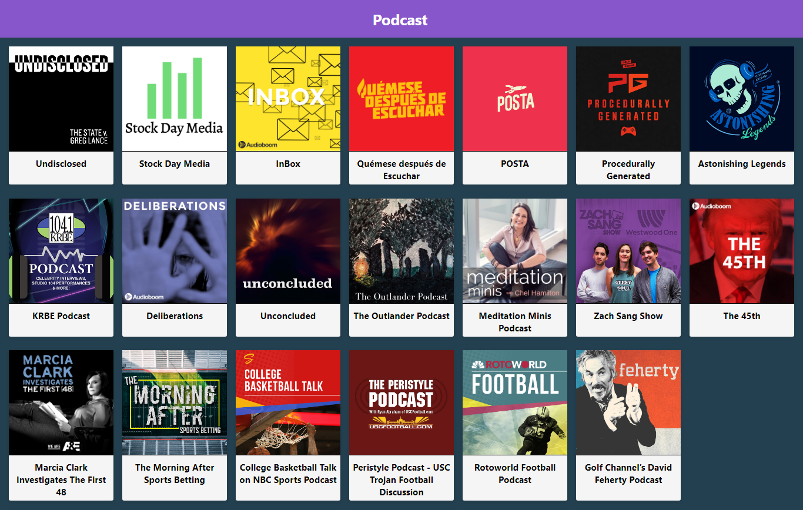

# Podcast app from Platzi

Podcast app integrated with the audioboom API to learn Next.JS

[Ver la aplicacion](https://podcast.surucobe.now.sh/)

## ¿How does it work?

Require Node.JS

* `npm install` for dependencies
* `npm run dev` for dev enviroment
* `npm run build && npm start` for production enviroment

## Licence

MIT
